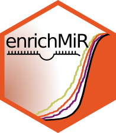
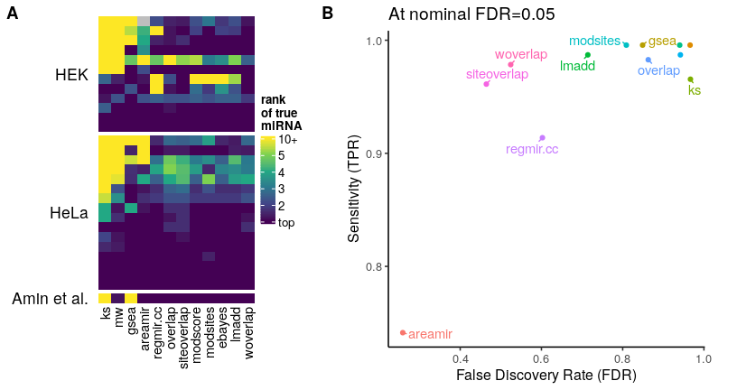

# enrichMiR

The enrichMiR R package implements various tests to identify 
miRNAs whose targets are enriched among genesets of interest 
or a differential expression signature.

To use the package internally, view the 
[vignette](vignettes/enrichMiR.Rmd). You may also use the 
[interactive app](https://ethz-ins.org/enrichMiR/).

  

## Enrichment tests

enrichMiR implements a variety of statistical tests which are
described in the app and publication. To guide users, we
benchmarked them using miRNA intervention experiments (partially
scrambled to increase difficulty). The benchmark results are
summarized in the Figure below (see publication for more detail).
In short, we recommend the siteoverlap, woverlap, lmadd and 
areamir tests; when using large annotations (e.g. scanMiR), we 
recommend the lmadd test (see publication).

